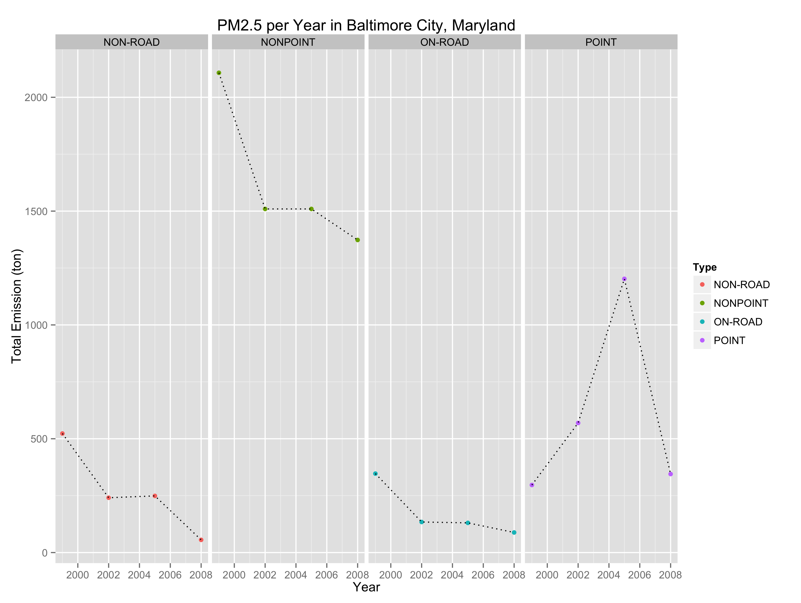
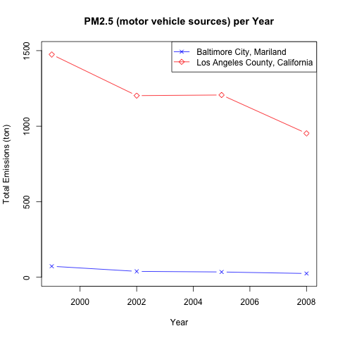

#Course Project 2
Repository connected with the __Course Project 2__ of "Exploratory Data Analysis " course on Coursera, March 2015.

##Introduction
*"Fine particulate matter (PM2.5) is an ambient air pollutant for which there is strong evidence that it is harmful to human health. In the United States, the Environmental Protection Agency (EPA) is tasked with setting national ambient air quality standards for fine PM and for tracking the emissions of this pollutant into the atmosphere. Approximatly every 3 years, the EPA releases its database on emissions of PM2.5. This database is known as the National Emissions Inventory (NEI). You can read more information about the NEI at the EPA National Emissions Inventory web site."*

*"For each year and for each type of PM source, the NEI records how many tons of PM2.5 were emitted from that source over the course of the entire year. The data that you will use for this assignment are for 1999, 2002, 2005, and 2008."*

###The data
*"PM2.5 Emissions Data __(summarySCC_PM25.rds)__: this file contains a data frame with all of the PM2.5 emissions data for 1999, 2002, 2005, and 2008. For each year, the table contains number of tons of PM2.5 emitted from a specific type of source for the entire year. ..."*

The PM2.5 Emissions Data contains the following variables

* _"fips: A five-digit number (represented as a string) indicating the U.S. county"_

* _"SCC: The name of the source as indicated by a digit string (see source code classification table)"_

* _"Pollutant: A string indicating the pollutant"_

* _"Emissions: Amount of PM2.5 emitted, in tons"_

* _"type: The type of source (point, non-point, on-road, or non-road)"_

* _"year: The year of emissions recorded"_

*"Source Classification Code Table __(Source_Classification_Code.rds)__: This table provides a mapping from the SCC digit strings in the Emissions table to the actual name of the PM2.5 source. The sources are categorized in a few different ways from more general to more specific and you may choose to explore whatever categories you think are most useful. For example, source “10100101” is known as “Ext Comb /Electric Gen /Anthracite Coal /Pulverized Coal”."*

###Assignment
__Common Assumption!__ 

* The data files have been downloaded from [here](https://d396qusza40orc.cloudfront.net/exdata%2Fdata%2FNEI_data.zip), and copied into the working directory for the running R environment.

* The data files and script files (e.g. plot1.R, plot2.R, etc) are all be located in the working directory for the running R environment.

####Question 1
*"Have total emissions from PM2.5 decreased in the United States from 1999 to 2008? Using the base plotting system, make a plot showing the total PM2.5 emission from all sources for each of the years 1999, 2002, 2005, and 2008."*

#####Answer to Question 1

Please look at the __plot1.R__ file and the generated __plot1.png__ for more info.

The totale PM2.5 emission in the United States has decreased in the United States from 1999 to 2008.

	# Total emission of PM2.5 per year in tons
	   1999    2002    2005    2008 
	7332967 5635780 5454703 3464206 

####Question 2
*"Have total emissions from PM2.5 decreased in the Baltimore City, Maryland (fips == "24510") from 1999 to 2008? Use the base plotting system to make a plot answering this question."*

#####Answer to Question 2

Please look at the __plot2.R__ file and the generated __plot2.png__ for more info.

The totale PM2.5 emission in Baltimore City, Maryland has decreased from 3271.180 tons (1999) to 1862.282 tons (2008).

	# Total PM2.5 Emission in tons in Baltimore City (Maryland) per Year
	  1999     2002     2005     2008 
	3274.180 2453.916 3091.354 1862.282

####Question 3
*"Of the four types of sources indicated by the type (point, nonpoint, onroad, nonroad) variable, which of these four sources have seen decreases in emissions from 1999–2008 for Baltimore City? Which have seen increases in emissions from 1999–2008? Use the ggplot2 plotting system to make a plot answer this question."*

#####Answer to Question 3

Please look at the __plot3.R__ file and the generated __plot3.png__ for more info.

The total emission of PM2.5 in Baltimore City, Maryland has the following trends  from 1999 to 2008

__NON-ROAD__ -> __decreased__ from 522.94 ton (1999) to 55.82356 ton (2008)

__NONPOINT__ -> __decreased__ from 2107.625 ton (1999) to 1373.207 ton (2008)

__ON-ROAD__ -> __decreased__ from 346.82 ton (1999) to 88.27546 ton (2008)

__POINT__ -> __increased__ from 296.7950 ton (1999) to 344.9752 ton (2008)

####Question 4
*"Across the United States, how have emissions from coal combustion-related sources changed from 1999–2008?"*

#####Answer to Question 4

Please look at the __plot4.R__ file and the generated __plot4.png__ for more info.

The total emission of PM2.5 (coal-combustion) across the United States has decreased from 596.6879 x 1000 ton (1999) to 355.9677 x 1000 ton (2008).

	#Total PM2.5 Emission (coal-combustion) in 
	#1000 tons per Year across US
	
	# Year   TotalEmissions (1000 ton)
	# 1999       596.6879
	# 2002       561.1747
	# 2005       566.7009
	# 2008       355.9677

####Question 5
*"How have emissions from motor vehicle sources changed from 1999–2008 in Baltimore City?"*

#####Answer to Question 5

Please look at the __plot5.R__ file and the generated __plot5.png__ for more info.

The total emission of PM2.5 (motor vehicle sources) in Baltimore City (Maryland) has decreased between 1999 and 2008 (see below)

	# Total PM2.5 Emission (motor vehicle sources) per Year in Baltimore City (Maryland)
	#   Year      TotalEmissions (ton)
	# 1 1999       72.52000
	# 2 2002       38.72593
	# 3 2005       34.73461
	# 4 2008       24.62275

####Question 6
*"Compare emissions from motor vehicle sources in Baltimore City with emissions from motor vehicle sources in Los Angeles County, California (fips == "06037"). Which city has seen greater changes over time in motor vehicle emissions?"*

#####Answer to Question 6

Please look at the __plot6.R__ file and the generated __plot6.png__ for more info.

Los Angeles County, California is the city that has gone through greater changes over time looking at the totale emissions (PM2.5) between 1999 and 2008.

	#Total Emissions (motor vehicle sources) of PM2.5 (ton) 
	#in Baltimore City, Maryland per Year
	# Year      TotalEmissions (ton)
	# 1 1999       72.52000
	# 2 2002       38.72593
	# 3 2005       34.73461
	# 4 2008       24.62275

	#Total Emissions (motor vehicle sources) of PM2.5 (ton)
	#in Los Angeles County, California per Year
	# Year      TotalEmissions (ton)
	# 1 1999      1474.3960
	# 2 2002      1202.2272
	# 3 2005      1206.4067
	# 4 2008       952.3045

